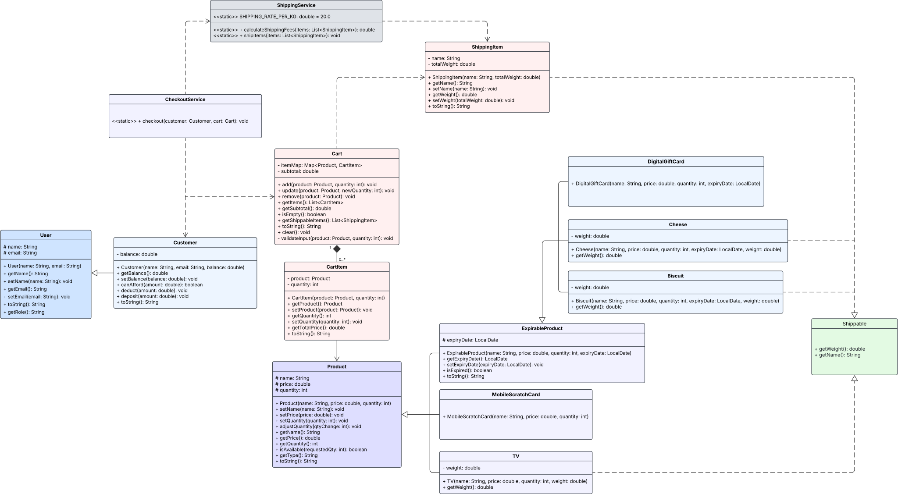

# 🛒 Fawry E-Commerce Checkout System

An object-oriented e-commerce checkout system designed as part of the Fawry Quantum Internship Challenge.

---

## ✅ Core Features

- **Product System**  
  Supports multiple product types:
  - Expirable products (e.g. Cheese, Biscuits)
  - Shippable products (e.g. TV, Cheese)
  - Mixed behaviors using inheritance and interfaces

- **User System**  
  Includes an abstract `User` class to support future roles (e.g., `Admin`, `Seller`).  
  Current implementation includes:
  - `Customer`: can hold a cart and perform checkout

- **Cart System**  
  - Tracks items via a `Map<Product, CartItem>`
  - Prevents adding beyond available quantity
  - Rejects expired products at the time of adding
  - Caches subtotal to avoid recomputation

- **Checkout Service**  
  - Validates cart, product states, and customer balance
  - Deducts stock and balance
  - Triggers shipping logic
  - Prints formatted receipt and shipping summary

- **Shipping Service**  
  - Accepts only `ShippingItem` (exposes `getName()` and `getWeight()`)
  - Calculates total shipping fee (20 EGP/kg)
  - Displays formatted shipping notice in grams

---

## 🧠 Design Decisions

- Created an abstract `User` class with future roles in mind (OCP)
- Used `CartItem` and `Map<Product, CartItem>` to avoid product duplication
- Created a minimal `ShippingItem` class to strictly follow interface spec:  
  `getName()` and `getWeight()` (total, not unit)

---

## 🔮 Future Roadmap

- 🔄 **Introduce Behavioral Pattern for Shipping**  
  Replace hardcoded fee logic with a Strategy pattern (e.g. `StandardShipping`, `ExpressShipping`, etc.)

- 🧰 **Refactor Validation to Utility Class**  
  Move common validation (nulls, strings, bounds) to a static `ValidationUtil` for DRY compliance

- 🧼 **Fix Method Duplication: `getWeight()`**  
  Currently exists on multiple levels (unit vs. total) — will refactor to clarify responsibility and reduce confusion

- 🧩 **User Roles Extension**  
  Extend `User` system to support:
  - `Admin` (manage platform)
  - `Seller` (manage product inventory)
  - Possibly role-based permissions via polymorphism

---
## 📊 UML Diagram

---
## 💡 Summary

This project reflects the foundation of a scalable, testable, and extensible e-commerce system.  
All core entities, services, and flows were designed to be aligned with OOP best practices and internship-level production expectations.

---

